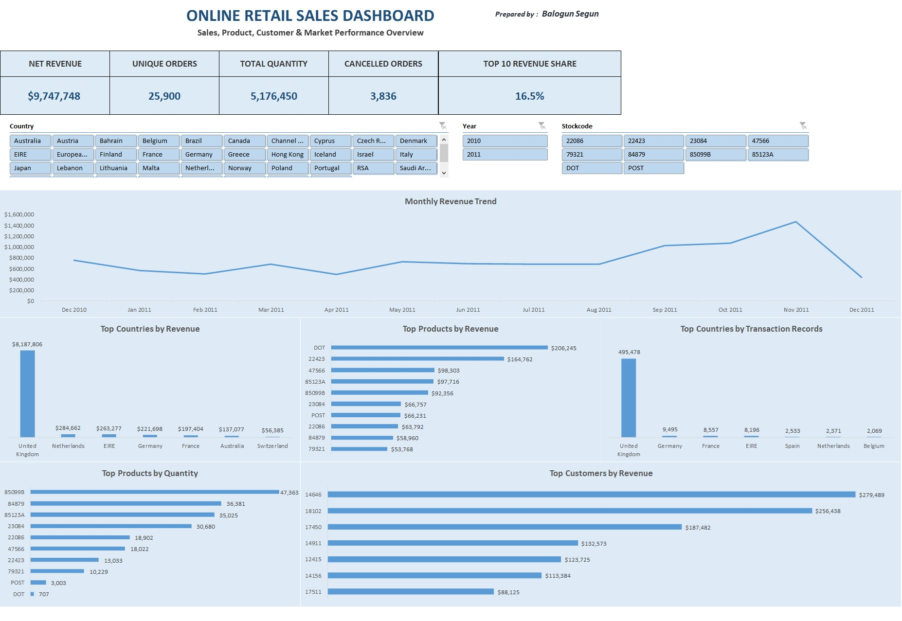

# Online Retail Sales Analysis

SQL and Excel analysis of the UCI Online Retail dataset, covering sales performance, customer behavior, product performance, country/market activity, cancellations, and revenue concentration.

## Dashboard Preview

## Tools Used
- **SQL / SQLite:** Data exploration, analysis, aggregation, and business investigation
- **Microsoft Excel:** PivotTables, PivotCharts, Slicers, and Dashboard design
- **Microsoft Word:** Case study reporting

## Repository Structure
- `/sql/` - SQL scripts for data exploration and analysis
- `/workbook/` - Excel workbook containing PivotTables and dashboard
- `/dashboard/` - Final dashboard preview
- `/report/` - Detailed project case study
- `/data/` - Dataset source and documentation

## Key Insights & Recommendations

### 1. Market & Revenue Concentration
- **Insight:** The UK dominates transaction activity and recorded revenue, while a relatively small group of customers contributes a significant share of identified-customer revenue.
- **Recommendation:** Analyze the factors driving UK transaction activity and the purchasing patterns of high-value customers to identify opportunities for market and customer growth.

### 2. Product & Monthly Performance
- **Insight:** High product quantity does not necessarily translate into high recorded revenue, while November showed unusually high sales activity.
- **Recommendation:** Analyze pricing, product mix, customer activity, and purchasing patterns behind high-volume and high-revenue products, as well as the factors contributing to the November sales peak.

### 3. Data Quality & Cancellations
- **Insight:** The dataset contains negative/zero quantities and cancellation records that affect recorded revenue.
- **Recommendation:** Analyze cancellation patterns across products, customers, markets, and periods to identify where cancellation activity is concentrated.

## Project Deliverables
- SQL analysis
- Interactive Excel dashboard
- Detailed case study report
- Business insights and recommendations

**Dataset Source:** [UCI Machine Learning Repository — Online Retail](https://archive.ics.uci.edu/dataset/352/online+retail)

